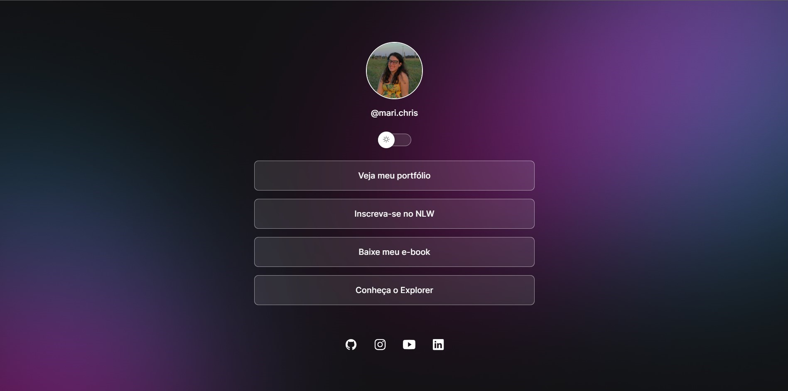
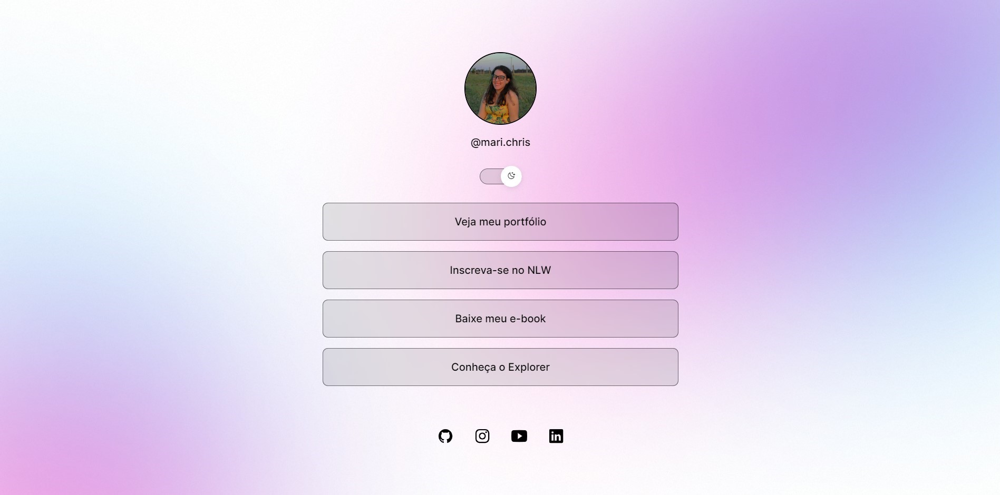

<h1 align="center"> DevLinks </h1>

Projeto desenvolvido durante o curso Discover, promovido pela Rocketseat.

  <a href="#-tecnologias">Tecnologias</a>&nbsp;&nbsp;&nbsp;|&nbsp;&nbsp;&nbsp;
  <a href="#-projeto">Projeto</a>&nbsp;&nbsp;&nbsp;|&nbsp;&nbsp;&nbsp;
  <a href="#-layout">Layout</a>&nbsp;&nbsp;&nbsp;|&nbsp;&nbsp;&nbsp;
  <a href="#memo-licença">Licença</a>

  

 

Modo Dark

  

Modo Light

  

## 🚀 Tecnologias

Esse projeto foi desenvolvido com as seguintes tecnologias:

- HTML e CSS
- JavaScript
- Git e Github

## 💻 Projeto

É um projeto de uma página de agregador de links, voltado para desenvolvedores.

## 🔖 Layout

Você pode visualizar o layout do projeto através [DESSE LINK](<https://www.figma.com/file/SsZgNY5SVrDP80UTUd22dV/DevLinks-%E2%80%A2-Projeto-Discover-(Community)?node-id=10%3A620&mode=dev/duplicate>).

## :memo: Licença

Esse projeto está sob a licença MIT.

---
